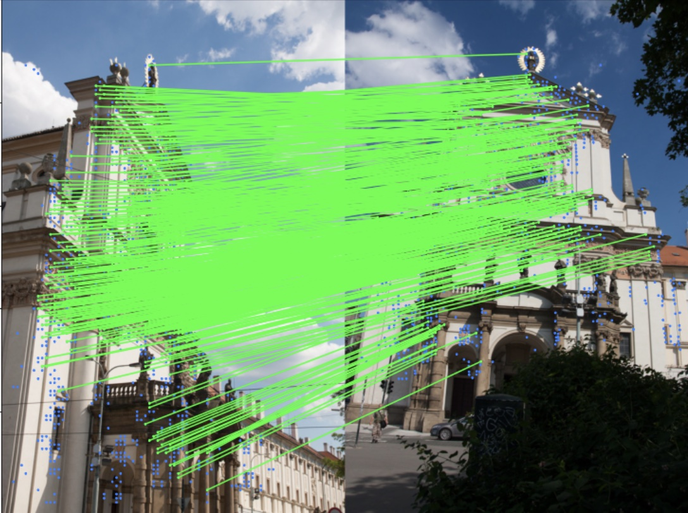
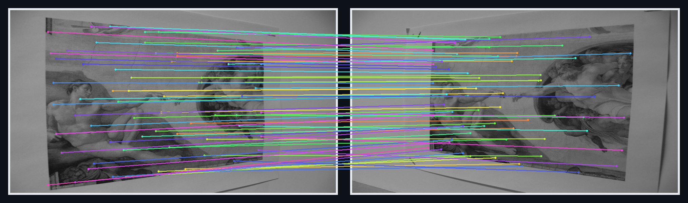

# `loftr-rs`

Rust workspace for a native [`tch`](https://crates.io/crates/tch)-based implementation of LoFTR.

## Demo

<table>
  <tr>
    <td align="center"><strong>Kornia reference</strong></td>
    <td align="center"><strong><code>loftr-rs</code> visualizer</strong></td>
  </tr>
  <tr>
    <td></td>
    <td></td>
  </tr>
</table>

The left image is the original Kornia LoFTR application demo from the
[Image Matching docs](https://kornia.readthedocs.io/en/latest/applications/image_matching.html).
The right image is generated locally with the Rust visualizer example in this repo, using the same
Kornia homography fixture inputs and a local LoFTR weight export:

```bash
python3 scripts/export_fixture_images.py /path/to/loftr_homo.pt /tmp/loftr-demo-inputs --prefix readme-demo
cargo run -p loftr --example render_demo --features download-libtorch -- \
  /path/to/loftr_outdoor_state_dict.safetensors \
  /tmp/loftr-demo-inputs/readme-demo-image0.png \
  /tmp/loftr-demo-inputs/readme-demo-image1.png \
  docs/images/loftr-rs-demo-rust.png \
  64
```

## Current Scope

The first public release is intentionally small:

- one publishable crate: `loftr`
- native Rust/tch LoFTR model construction and inference
- local weight export and validation scripts

Not included in v0.1:

- panorama stitching helpers
- calibration pipelines
- application-specific runtime glue

## Toolchain

- Rust edition: `2024`
- MSRV: `1.85.0`
- CI target: MSRV plus latest stable Rust

## Weights

Pretrained weights are not committed to git and are not bundled into the published crate.

Generate local weights with:

```bash
./scripts/generate_loftr_state_dict.sh
```

By default, this writes:

```text
artifacts/weights/loftr_outdoor_state_dict.safetensors
```

## Libtorch Setup

This crate uses `tch`, so you need a working libtorch setup.

Common options:

```bash
LIBTORCH_USE_PYTORCH=1 cargo test
```

or:

```bash
LIBTORCH=/path/to/libtorch cargo test
```

If you want automatic downloads, enable the feature that forwards to `tch`:

```bash
cargo test -p loftr --features download-libtorch
```

## Workspace Commands

```bash
just fmt
just check
just test
just publish-dry-run
```

## Validation

For local parity checks against Kornia's Python LoFTR reference, use:

```bash
./scripts/validate_loftr_against_kornia.sh /path/to/left.jpg /path/to/right.jpg
```
